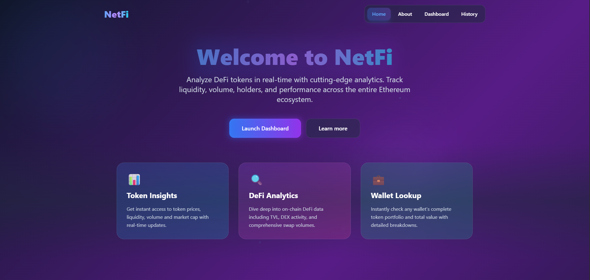

# NetFi 🔍📊

NetFi is a modern DeFi token analyzer that allows users to search Ethereum-based tokens by address or symbol and retrieve real-time token data, price charts, holders statistics, and DEX liquidity pool insights — all from a clean, intuitive interface.




---

## 🚀 Features

- 🔍 **Token Search** – Search by contract address, symbol, or token name.
- 📈 **7-Day Price Chart** – Visualize token price trends over the last week.
- 🧠 **Real-Time Data** – Fetches market data, volume, and market cap via CoinGecko.
- 👥 **Holders Count** – Pulls total holders info from Etherscan.
- 🔁 **DEX Stats** – Displays top liquidity pools from Dexscreener.
- 💾 **Search History** – Automatically saves previous token searches (address, name, symbol, etc.) in `localStorage` with support for:
  - Viewing saved tokens
  - Deleting individual entries
  - Clearing entire search history

---

## 🛠️ Tech Stack

- **React** with Hooks
- **Tailwind CSS** for styling
- **Chart.js** for price visualizations
- **Axios** for API calls
- **React-Toastify** for notifications
- **React-Spinners** for loaders
- **CoinGecko API**, **Etherscan**, and **Dexscreener** for DeFi data

---

## 📦 Installation

```bash
git clone https://github.com/Dev-Rodiyat/NetFi.git
cd NetFi
npm install
npm run dev
````

Ensure you have a `.env` file (if needed) for any private API keys or configs.

---

## 🧪 Usage

1. Launch the app.
2. Enter a token address, symbol, or name in the search bar.
3. View detailed token data, including:

   * Price
   * Market cap
   * Volume
   * Holders
   * Liquidity pools
   * 7-day price chart
4. Navigate to the **History Page** to revisit or manage past token searches.

---

## 📂 Project Structure

```
src/
├── components/
│   ├── Header.js
│   ├── Footer.js
│   ├── Layout.js
│   ├── MobileMenu.js
│   ├── ScrollToTop.js
│   └── TokenSearchBar.jsx
├── hooks/
│   ├── useTokenData.js
│   └── useDexStats.js
├── pages/
│   ├── Home.jsx
│   ├── About.jsx
│   ├── Dashboard.jsx
│   ├── History.jsx
│   └── NotFound.jsx
├── utils/
│   └── getEtherscanStats.js
└── App.jsx
```
