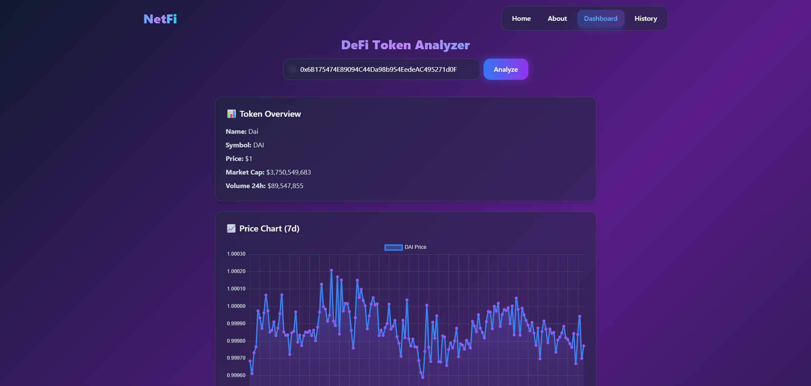
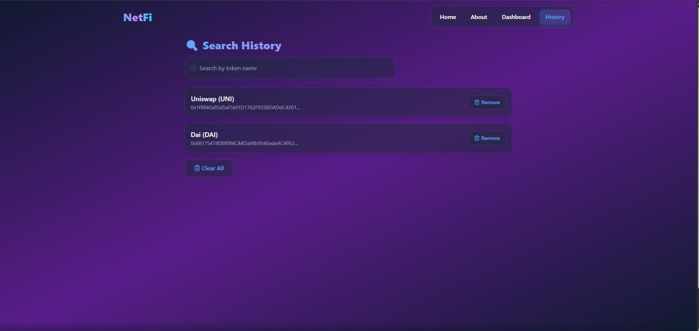
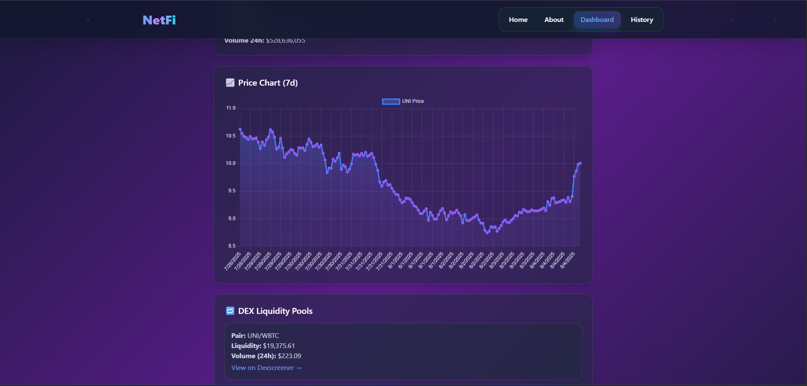

# 💼 StackJobs - Job Board Frontend App

A sleek and modern frontend application that allows users to search and explore job listings from around the world. This app uses a job-related API from [RapidAPI](https://rapidapi.com/) to fetch real-time data.

## ✨ Features

- 🔍 Search jobs by keyword or title
- 📍 Filter by location
- 🧠 View job descriptions and requirements
- 🌐 Responsive UI for desktop and mobile
- 🚀 Powered by [RapidAPI] for dynamic job data

## 📸 Screenshots




## 🔧 Tech Stack

- **React + Vite** – UI library
- **Tailwind CSS** – Styling
- **Axios** – For API requests
- **React Router** – Routing
- **RapidAPI** – Job data API

## 🔑 Getting Started

### 1. Clone the Repository

```bash
git clone https://github.com/Dev-Rodiyat/StackJobs.git
cd StackJobs
````

### 2. Install Dependencies

```bash
npm install
```

### 3. Setup Environment Variables

Create a `.env` file in the root and add your API credentials:

```env
VITE_JOB_API_KEY=your_rapidapi_key
```

> 📌 You can find these values in your RapidAPI dashboard after subscribing to the job API you're using.

### 4. Start the Development Server

```bash
npm run dev
```

Your app should now be running at `http://localhost:5173`

## 📁 Project Structure

```
src/
├── components/       # Reusable UI components
├── pages/            # Page-level components (Home, JobDetails, etc.)
├── api/              # API request logic
├── assets/           # Images, icons
├── App.jsx           # Root component with routing
└── main.jsx          # Entry point
```

## 🙌 Acknowledgements

* [RapidAPI](https://rapidapi.com/) for providing the job listings API
* [Tailwind CSS](https://tailwindcss.com/) for utility-first styling
* [React](https://react.dev/) for the frontend framework
